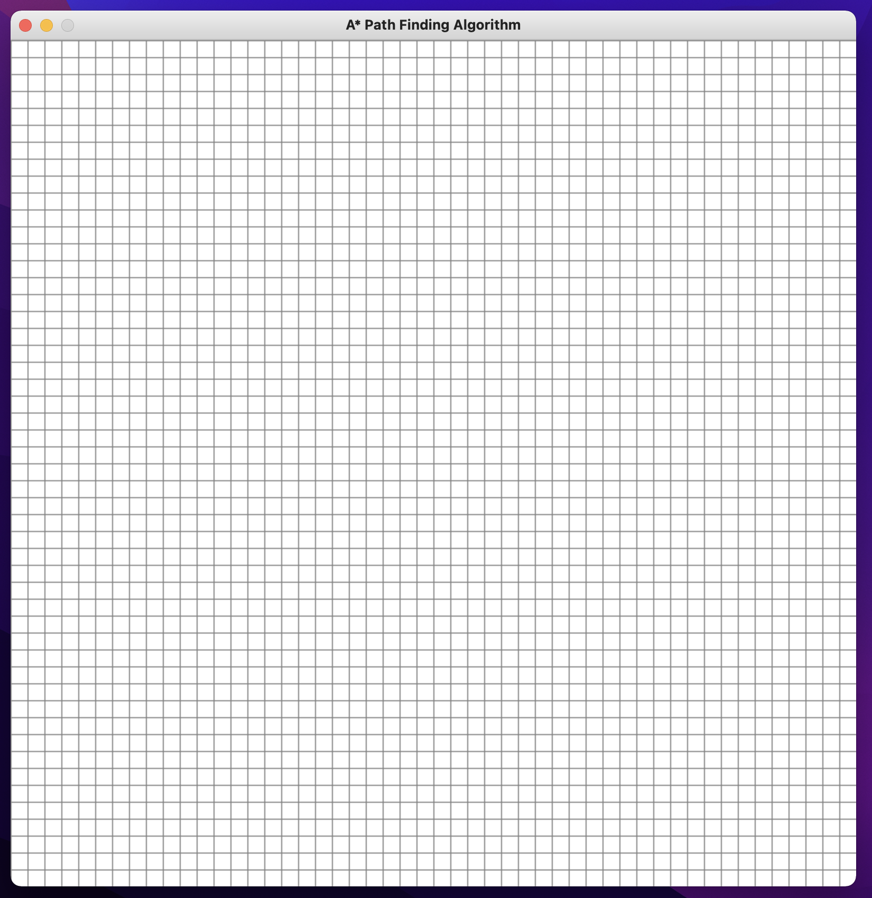
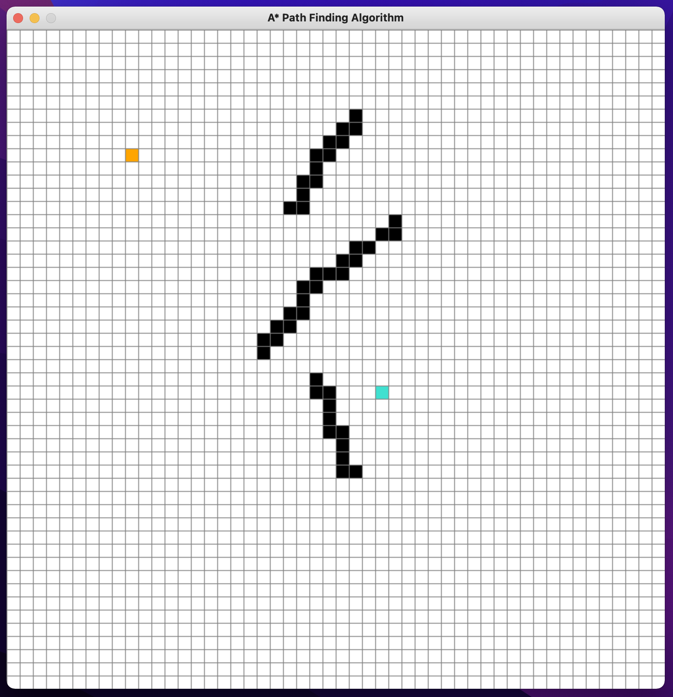
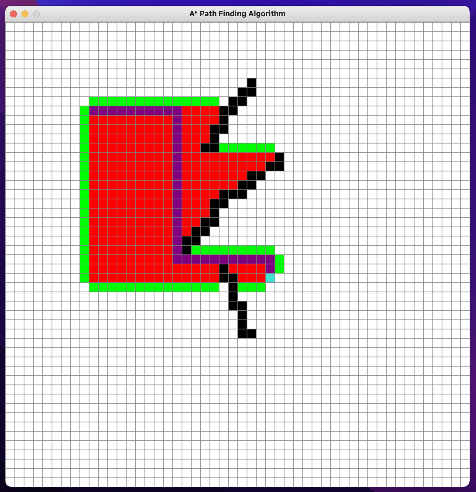

# Pathfinding Visualizer
This interactive python program allows you to choose start position, end position, and obstacles in a grid. It then finds the shortest path using A* Pathfinding Algorithm.
## Prerequisites
You need to have Python 3 and Pygame installed on your device to run the script.
## How to use it
1. Run the program. Window with a 50x50 grid should open.

2. Click on any position in the grid. This will be the start position (denoted by orange color).
3. Click again on any other position. This will be the destination position (denoted by blue color).
4. You can click wherever else in grid to create obstacles.
5. You can right mouse click on any of the previous positions to erase them.

6. Click the spacebar. This will launch the visualization to find the shortest path from start to finish.
7. The resulting shortest path will be violet.

8. Click 'c' to clear the grid and start again.
